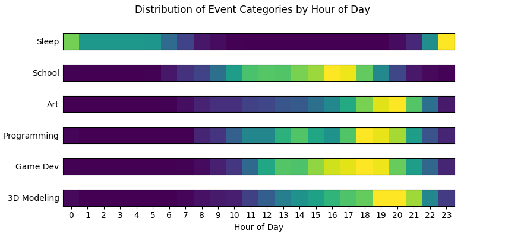

# CalendarStats

This is some data analysis done on one of my personal Google Calendar calendars.

The calendar is used for planning the day via loose time blocking.

## Dataset

The dataset is omitted for privacy, but this project will extract Google Calendar information given that you have a Google Cloud project with access to the Google Calendar API.

The dataset contains Google Calendar events created from 11/03/2018 onward (Approximately 13,800 events).

The name of each event (called the "summary" of the event) generally corresponds to the name of a category of activity (e.g. "School" refers to doing school-related work).

The dataset also has the date of the event, the start / end time, timezone, and duration of event.

### Notes

The naming scheme of summaries is not perfectly consistent and includes mispellings that will need to be corrected.

The timezone is mostly the same across all events, but is different in others which means certain times need to be adjusted.

## Analysis
Each analysis is done on a subset of the categories in the dataset

### 1: Distribution of Event Categories by Hour of Day

